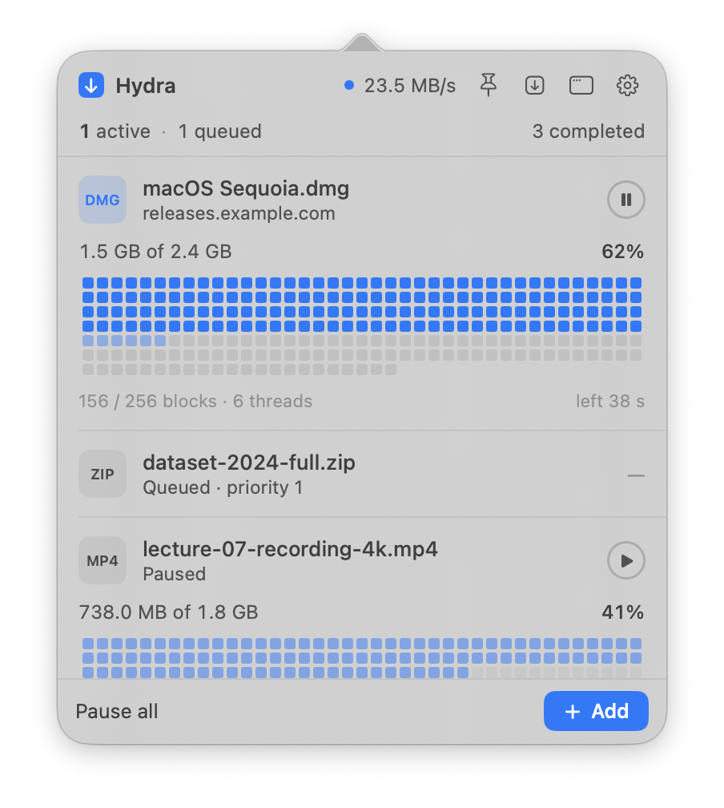
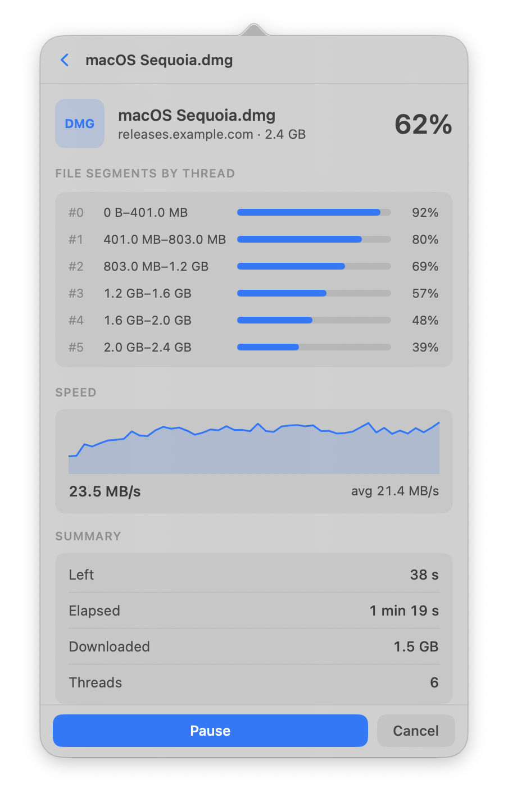
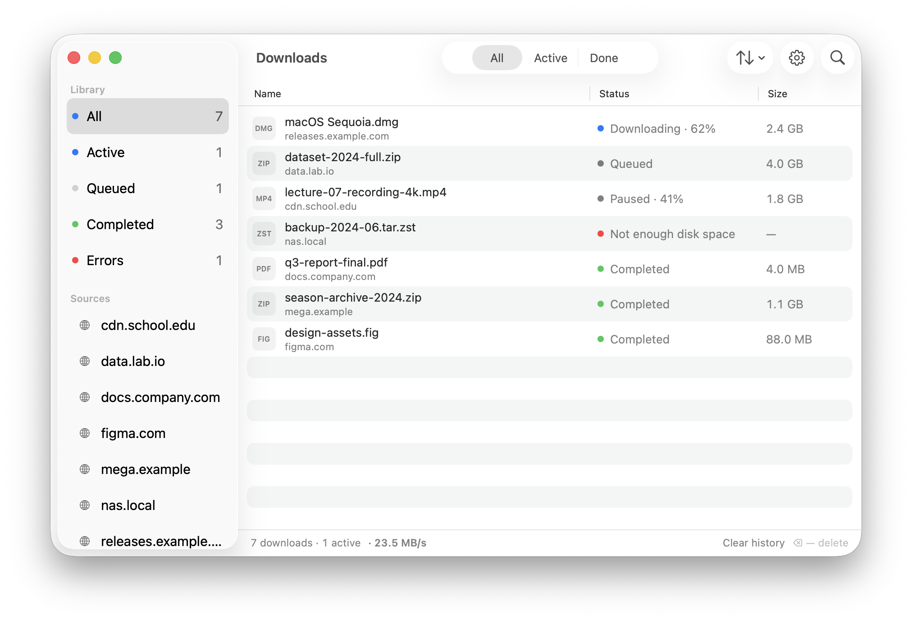
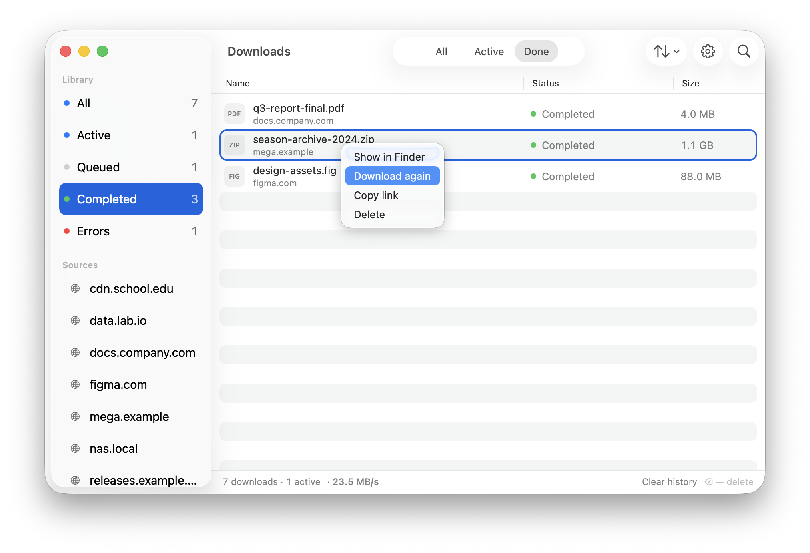
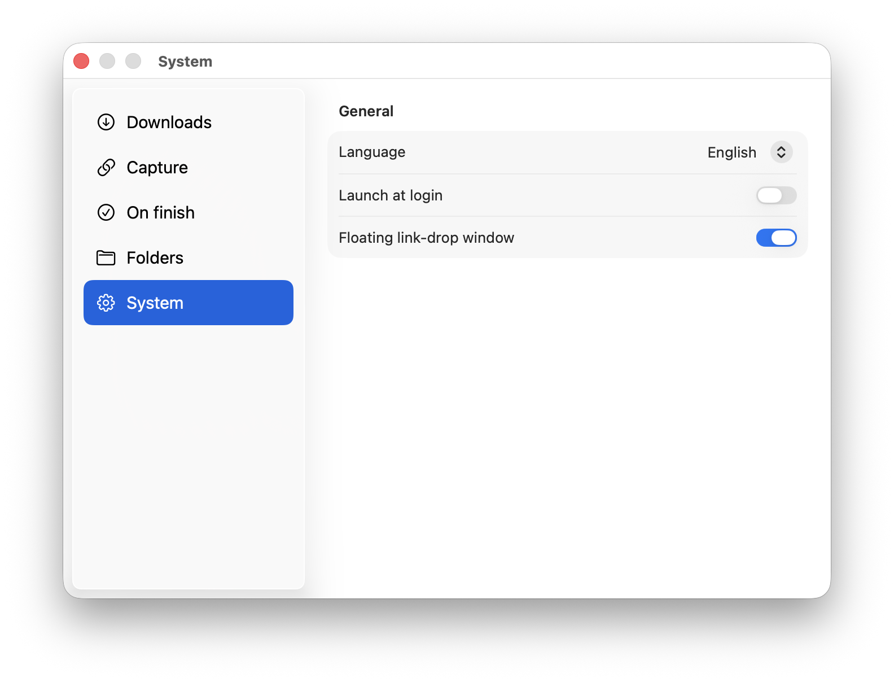
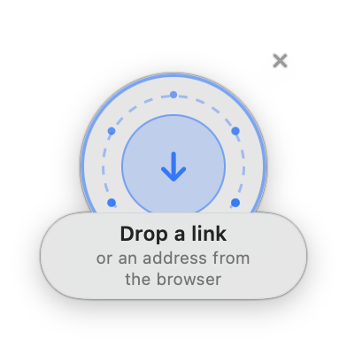

<div align="center">


# Hydra

[English](README.md) · [Русский](README.ru.md) · **中文**

[](https://github.com/pushipu/Hydra/releases)
[](https://github.com/pushipu/Hydra/releases)
[](LICENSE)

[](https://github.com/pushipu/Hydra/stargazers)

**支持浏览器会话透传的 macOS 多线程下载管理器。**

以多条并行流（HTTP Range）下载文件，并在每一条流中重放你已登录的浏览器会话——
因此下载更快，也能下载只有你才能访问的内容。常驻菜单栏，自动与浏览器配对，
无需复制 id 或修改配置。

macOS 13+ · Swift · 原生 SwiftUI/AppKit

</div>

---

## 功能

- **多线程下载** — 文件被切分为块，连接池并行拉取（HTTP Range）。速度、剩余时间
  和线程数实时显示。
- **会话透传** — 扩展为链接抓取 `Cookie`、`User-Agent`、`Referer`，并在**每一条**
  流中重放。能下载登录后才可见的内容。
- **可跨重启的暂停 / 恢复** — 已完成块的位图写入磁盘；在下载未完成时退出 → 重新
  打开 → 从原处继续。
- **碎片整理块网格** — 一眼看清整个文件：已完成、正在下载、待下载，以及「X / Y 块」。
- **队列** — 同时下载数量上限，其余排队；优先级、全部暂停。
- **历史** — 已完成的下载在重启后保留，支持搜索与「在访达中显示」。
- **浏览器拦截** — 按规则自动拦截（大小、文件类型），或右键菜单「通过 Hydra 下载」。
- **拖放浮窗** — 始终置顶；从任何地方把链接拖入。
- **原生通知** — 完成、错误（带「重试」）、需要登录。
- **更新检查** — 启动时若 GitHub 上有更新版本会提示；可在设置/菜单手动检查。
- **原生 macOS 外观** — 系统强调色、材质/通透感、SF 字体、深色/浅色主题。
- **多语言** — 英文、俄文、中文；在 设置 → 系统 → 语言 中切换。

## 为什么选 Hydra

面向 macOS 的免费开源下载加速器 —— IDM、Folx、JDownloader 的原生替代品，
无需付费，也不依赖 Java。

| | 浏览器自带 | 常见下载管理器 | **Hydra** |
|---|:---:|:---:|:---:|
| 多线程（HTTP Range） | ❌ | ✅ | ✅ |
| 透传已登录会话 | ❌ | ⚠️ 部分 | ✅ cookies + UA + referer |
| 下载登录后才可见的文件 | ❌ | ⚠️ | ✅ |
| 重启后暂停/恢复 | ⚠️ | ✅ | ✅ 按块 |
| 原生菜单栏应用 | — | 不一 | ✅ SwiftUI / AppKit |
| 开源、免费 | — | 通常收费 | ✅ MIT |

## 截图

| 菜单栏弹窗 | 下载详情（多线程） |
|---|---|
|  |  |

| 下载窗口 | 单条下载操作 |
|---|---|
|  |  |

| 设置 | 悬浮拖放圆环 |
|---|---|
|  |  |

## 工作原理

```
浏览器 ──(链接拦截 + 会话)──▶ 扩展
                                 │ native messaging
                                 ▼
                           hydra-host  ──(Unix socket /tmp/hydra.sock)──▶ Hydra.app
                            (回退：app 未运行时自行下载)                        │
                                                                                ▼
                                                                         DownloadCore
                                                                probe → 分块 → N 条流 → 合并
```

- **无需用户操作的自动配对。** Chrome id 由清单中的 key 固定（确定性的
  `hfdmeoleepighofjiookfjcjekoopaim`），Hydra.app 启动时把 native-messaging 主机
  注册到所有浏览器。无需复制 id，也无需 `install.sh`。
- **两套引擎核心：** `ResumableDownload`（基于块，暂停/恢复 — 供应用使用）与
  `Downloader`（连续分片，一次性 — 供 CLI 和主机回退使用）。两者均有逐字节测试覆盖。

## 安装

### Homebrew（最简单）

```bash
brew install --cask --no-quarantine pushipu/tap/hydra
```

应用目前为 ad-hoc 签名（尚未公证），需要 `--no-quarantine` 才能绕过 Gatekeeper
直接打开。之后从下面第 2 步继续。

### 手动

1. 从 [Releases](../../releases) 下载最新的 `Hydra-*-macos.zip`，解压，将 `Hydra.app`
   拖入 `/Applications`，运行一次 —— 它会把主机注册到所有已安装的浏览器。
2. 安装你浏览器的扩展 —— 两者都已内置于应用中。打开
   **设置 → 拦截 → 安装扩展**（或菜单栏菜单 →「安装扩展…」）；访达会打开内置的
   `chrome/` 文件夹和 `hydra-firefox.xpi`：
   - **Chrome / Brave / Edge：** `chrome://extensions` → 开发者模式 →
     「加载已解压的扩展程序」→ `chrome/` 文件夹。
   - **Firefox 140+：** `about:debugging` →「临时载入附加组件」→
     `hydra-firefox.xpi`。永久安装需要经 AMO 签名的 XPI。
   - **Safari：** 目前需通过 Xcode 手动安装（[docs/SAFARI_SETUP.md](docs/SAFARI_SETUP.md)）。
3. 完成 —— cookie/会话与多线程立即生效。

> 分发到其他机器需要公证（Developer ID）。本机使用 ad-hoc 签名即可 ——
> `Hydra.app` 在自己机器上无警告启动。

## 从源码构建

需要 Xcode/Swift 工具链和 `rsvg`（用于图标：`brew install librsvg`）。

```bash
./build-all.sh
```

产物输出到 `dist/`：`Hydra.app`（内嵌主机、自注册）、`chrome/`（已解压扩展）、
`hydra-chrome.zip`、`hydra-firefox.xpi`。

版本号统一来源于 `VERSION` 文件：构建时写入应用的 `Info.plist` 和所有扩展清单
（`CFBundleVersion` = git 提交数）。改 `VERSION`、重新构建——应用与扩展保持同步。

```bash
cd core && swift test          # 引擎测试（逐字节、恢复、文件名清洗）
.build/release/hydractl URL --out ~/Downloads --connections 8   # CLI
```

## 目录结构

```
core/Sources/
  DownloadCore/   引擎：probe、分块、恢复、会话、限速、历史
  HydraApp/       SwiftUI/AppKit：弹窗、窗口、设置、拖放区、通知
  hydractl/       CLI
  hydra-host/     native messaging 主机（委派给 app，回退 —— 自行下载）
extension/        WebExtension（Chrome/Firefox），固定 key，配对状态弹窗
app/build.sh      构建 Hydra.app（签名、内嵌主机、图标）
build-all.sh      ⭐ 一次性全部构建 → dist/
docs/             ARCHITECTURE.md、SAFARI_SETUP.md、USAGE.md、screenshots/
```

## 浏览器扩展

一个轻量层：经用户明确同意后抓取会话、拦截链接，并显示连接状态和简短的本地传输记录。
下载管理保留在应用中。拦截设置（自动拦截、最小大小、文件类型、线程数）以应用为唯一来源，
扩展通过主机读取。

## 常见问题

**Hydra 是 macOS 上免费的 IDM / Folx 替代品吗？**
是 —— 开源（MIT）、多线程、透传浏览器会话、原生应用。

**它如何下载登录后才可见的文件？**
扩展会抓取该链接的 `Cookie`、`User-Agent`、`Referer` 并在每条并行连接中重放，
服务器即可识别你的登录会话。

**支持哪些浏览器？**
通过扩展支持 Chrome、Brave、Edge 和 Firefox。Safari 目前需手动设置。

**安全吗？扩展读取什么？**
仅读取 cookie 以把已有会话传给同一台 Mac 上的 Hydra。没有遥测，也没有开发者运营的数据服务器。
请参阅[隐私政策](PRIVACY.md)。

**暂停/恢复能在重启后保留吗？**
能。已完成块的位图写入磁盘，可退出后稍后继续。

**macOS 提示应用「无法打开」怎么办？**
当前 GitHub 版本已使用 Developer ID 签名并通过 Apple 公证。请确认下载自本仓库且未被修改。

## 许可证

[MIT](LICENSE) © pushipu
